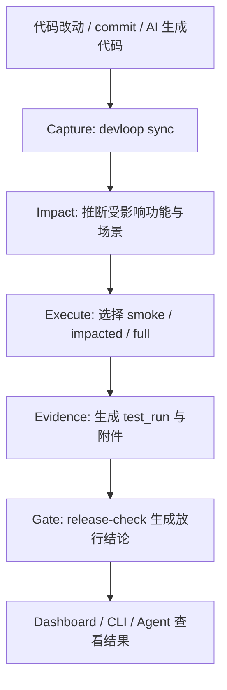

# PRD：DevLoop — AI 开发项目的测试闭环与发布风险闸门

| 字段 | 内容 |
|------|------|
| 版本 | v1.4 |
| 创建时间 | 2026-06-09T22:50:00+08:00 |
| 更新时间 | 2026-06-09T23:16:37+08:00 |
| 状态 | **草案** — 待评审 |
| 类型 | **产品 PRD** — DevLoop 工具本体 |
| 产品名 | **DevLoop**（**已定**） |
| CLI 命令 | **`devloop`**（**已定**） |
| npm 发布名 | **`@<org>/devloop`**（推荐）；备选 `devloop-cli` |
| GitHub 仓库 | `github.com/<your-org>/devloop` |
| 本地路径 | `/Users/jeff/developer/devLoop` |
| 技术栈 | **Node.js**（TypeScript monorepo） |
| 分发方式 | **npm** 全局安装 / `npx @<org>/devloop` 零安装运行 |
| 开源协议 | MIT（建议，待评审确认） |

---

## 0. 文档目的

本文档定义 **DevLoop** 的产品需求。DevLoop 面向重度使用 AI Agent 开发项目的个人与小团队，目标不是做一个“更好看的测试台账”，而是建立一条可执行的闭环：

> **每次改动能被捕获，每次测试有上下文和证据，每次发布前有明确风险闸门。**

DevLoop 不是单一编辑器插件，而是**可安装到任意业务项目**的独立工具：**CLI 核心 + 本地浏览器仪表盘**，与 git、Agent 和项目文档体系协同工作。

---

## 1. 背景与痛点

### 1.1 用户现状

- AI 开发速度极快，功能产出远快于人工记录速度。
- 每天改动很多文件和功能域，但**没有低摩擦的自动记录**。
- 过几天想“系统测一遍”时，**不知道先启动什么、用什么数据、测哪些入口**。
- 测试状态常停留在“感觉测过了”，但**没有 commit 级别的证据和结果追踪**。
- 上线时没有硬性的放行条件，导致**明知有风险也会先发**。
- 功能被重做后，旧测试结果失效，但**系统不会自动告诉你哪些测试已作废**。

### 1.2 核心诉求（一句话）

> DevLoop 要让 AI 开发项目形成 `capture -> impact -> execute -> evidence -> gate` 的测试闭环，而不是只提供一个记录面板。

### 1.3 要解决的核心问题

1. 改了什么
2. 影响了哪些功能
3. 现在该从哪一套场景开始测
4. 测试是否真的在当前代码状态下完成
5. 这一版是否可以上线

### 1.4 非目标（v1 不做）

- 不替代专业 QA 平台，也不承诺 100% 无 bug。
- 不绑定单一编辑器；Cursor、Codex、Claude Code 等都应能接入。
- v1 不做无限自动修 bug；仅为后续版本预留有界 auto-fix 能力。
- v1 不做云端 SaaS；首版为**本机运行**的 CLI + 本地 Web UI。
- v1 不做复杂的企业审批流；发布闸门只关注技术风险放行。

---

## 2. 产品定位

| 维度 | 定义 |
|------|------|
| 产品定位 | **AI 开发项目的本地测试操作系统** |
| 核心价值 | 把分散的开发记录、回归执行、测试证据、发布前把关串成闭环 |
| 产品形态 | CLI + 本地 Web 仪表盘 |
| 使用者 | 高频使用 AI 开发的个人开发者、小团队、技术负责人 |
| 关键时刻 | 每次同步开发状态、每次局部测试、每次全量回归、每次发版前 |
| 首要原则 | **低摩擦采集、证据优先、风险可见、发布可拦截** |

### 2.1 产品一句话

> DevLoop 是为 AI 开发时代设计的测试闭环工具：它自动捕获改动、推断影响范围、调用可复现场景执行测试、沉淀证据，并在发布前给出明确的放行结论。

### 2.2 用户安装与使用

推荐使用 scoped npm 包，CLI 命令统一为 `devloop`：

```bash
# 方式 A：全局安装（推荐）
npm install -g @your-org/devloop
devloop --version
devloop init
devloop ui

# 方式 B：零安装试用
npx @your-org/devloop init
npx @your-org/devloop status

# 方式 C：项目 devDependency
npm install -D @your-org/devloop
npx devloop release-check
```

| 要求 | 说明 |
|------|------|
| Node.js | >= 18 LTS |
| 操作系统 | macOS、Linux、Windows（WSL 推荐） |
| Git | 业务项目须为 git 仓库 |
| 浏览器 | 任意现代浏览器访问 `localhost` |

### 2.3 npm 包名策略

`devloop` 裸包名已被占用，因此：

| 项 | 取值 |
|----|------|
| 品牌名 | **DevLoop** |
| 安装包名 | **`@<org>/devloop`** |
| CLI 命令 | **`devloop`** |
| 零安装命令 | **`npx @<org>/devloop <cmd>`** |

如未来 scoped 包不可用，可退回 `devloop-cli`，但对外文档默认只写 `@<org>/devloop`。

---

## 3. 设计原则

### 3.1 低摩擦优先

目标用户正是“没时间维护系统的人”，因此 DevLoop 必须优先自动采集和候选建议，减少手工录入。

### 3.2 证据优先于口头状态

`tested` 不是一句话，而是一条绑定 `commit_sha`、`scenario`、`result`、`artifact` 的执行记录。

### 3.3 先判断影响，再决定测试范围

DevLoop 不应要求用户每次手工想“要测什么”，而应先根据改动推断 impact set，再推荐最小必要回归。

### 3.4 一个机器真相源

测试状态、执行记录、发布闸门结果只能有一个机器真相源。Markdown 文档可以存在，但应作为投影视图，不应与机器状态双写冲突。

### 3.5 发布必须可拦截

如果存在高风险未验证改动，系统应明确给出 `block`，而不是只展示一个“红色提醒”。

---

## 4. 产品工作流

DevLoop 的主流程定义为：



### 4.1 五个阶段

| 阶段 | 问题 | 输出 |
|------|------|------|
| Capture | 改了什么 | 变更摘要、候选 feature、候选 checklist 更新 |
| Impact | 影响了什么 | impacted features、impact confidence、推荐场景 |
| Execute | 现在怎么测 | scenario、scope、执行日志 |
| Evidence | 是否真的测过 | `test_run`、artifact、状态回写 |
| Gate | 能不能发 | `pass / warn / block` 结论与原因 |

---

## 5. 信息架构与真相源

### 5.1 机器真相源

DevLoop 采用 `.devloop/` 下的结构化文件作为唯一机器真相源：

```text
业务项目/
  .devloop/
    config.yml
    registry.json
    scenarios/
      *.yml
    test-runs/
      YYYY-MM-DD/
        run-*.json
    releases/
      release-check-*.json
    cache/
      impact-index.json
  docs/
    test/
      FEATURE_REGISTRY.md      # 由机器数据生成的人类可读视图
    prd/
      YYYY-MM-DD/
        feature-{slug}.md
        dev_all_YYYY-MM-DD.md
  AGENTS.md
  .agents/skills/
```

### 5.2 文档与数据的职责边界

| 文件 | 角色 |
|------|------|
| `.devloop/registry.json` | **功能状态真相源** |
| `.devloop/test-runs/**/*.json` | **测试执行真相源** |
| `.devloop/releases/*.json` | **发布闸门真相源** |
| `docs/test/FEATURE_REGISTRY.md` | registry 的人类可读投影 |
| `docs/prd/**` | 需求、验收项、迭代说明的叙述层 |
| `dev_all_*.md` | 每日开发摘要与测试入口索引，不承载机器状态真相 |

### 5.3 基本对象模型

| 对象 | 用途 |
|------|------|
| `feature` | 功能域与其测试状态 |
| `scenario` | 可复现的测试上下文与步骤 |
| `test_run` | 一次真实执行记录 |
| `release_check` | 一次发版判断结果 |
| `iteration` | 功能重做后的当前有效版本 |

---

## 6. 核心功能需求

### 6.1 低摩擦变更捕获（Capture）

**优先级：P0**

`devloop sync` 必须完成两件事：

1. 自动分析 `git diff` / 最近 commit / 当前工作树
2. 生成供用户确认的候选影响信息，而不是要求用户从空白开始记录

#### 6.1.1 触发方式

| 触发方式 | 说明 |
|----------|------|
| 手动 | `devloop sync` 或 UI「同步改动」 |
| Git hook | 可选 `post-commit` |
| Agent | 口令「同步开发状态」 |

#### 6.1.2 sync 输出

| 输出 | 说明 |
|------|------|
| changed_files | 本次改动文件列表 |
| candidate_features | 推断出的受影响功能候选 |
| candidate_prd_refs | 关联到的 PRD/spec 候选 |
| suggested_actions | 建议执行 `smoke` / `impacted` / `full` |
| state_updates | 对 registry 的待确认状态更新 |

#### 6.1.3 低摩擦原则

- 允许用户只确认候选结果，而非完整手填。
- 若无法高置信识别 feature，进入 `needs-triage` 状态，而不是静默忽略。
- 同步后默认把受影响功能标为 `changed_untested`，直到出现当前 HEAD 上的成功证据。

### 6.2 影响分析（Impact）

**优先级：P0**

DevLoop 的价值不应停留在“知道改了哪些文件”，还要回答“哪些功能真的受影响”。

#### 6.2.1 影响判断输入

1. `paths` 映射
2. import / dependency 关系
3. 历史 test failure 与 flaky 记录
4. feature 与 scenario 的手工绑定
5. 共享底层模块命中规则

#### 6.2.2 输出字段

| 字段 | 说明 |
|------|------|
| impacted_features[] | 推断出的功能集 |
| confidence | `high / medium / low` |
| reasons[] | 命中路径、依赖链、历史风险等原因 |
| recommended_scope | `smoke` / `impacted` / `current+p0` / `full` |

#### 6.2.3 护栏

- 不能只依赖 glob 路径。
- 命中共享底层模块时，应扩大影响范围或至少降级为 `medium/low confidence`。
- `low confidence` 时 UI 必须提示人工复核。

### 6.3 功能注册表（Feature Registry）

**优先级：P0**

Registry 是“当前系统有哪些功能、这些功能现在处于什么测试状态”的中心视图。

#### 6.3.1 feature 字段

| 字段 | 说明 |
|------|------|
| feature_id | 稳定 ID，如 `host-listen` |
| name | 中文显示名 |
| priority | `P0 / P1 / P2` |
| tags[] | 域标签，如 `audio`、`admin` |
| paths[] | 相关代码路径 |
| specs[] | 主规范或 feature PRD |
| scenarios[] | 关联 scenario ID |
| status | `never_tested / changed_untested / rework_untested / tested / failed / needs-triage` |
| iteration | 当前迭代号 |
| active_checklist[] | 当前迭代有效验收项 |
| invariants[] | 跨迭代仍必须成立的 P0 不变量 |
| last_changed_at | 最近变更时间 |
| last_changed_sha | 最近变更 commit |
| last_verified_run_id | 最近成功验证该 feature 的 run |
| last_verified_sha | 最近成功验证时对应的 commit |

#### 6.3.2 状态规则

- 当前 HEAD 上无成功 `test_run` 且有改动 -> `changed_untested`
- 功能被重做后 -> `rework_untested`
- 从未有成功验证 -> `never_tested`
- 最近一次相关 run 失败 -> `failed`
- 信息不足 -> `needs-triage`
- 存在当前 HEAD 上的成功证据 -> `tested`

### 6.4 场景包（Scenario Pack）

**优先级：P0**

这是本 PRD 相比旧版最大的新增。DevLoop 必须解决“完整测试不知道从哪开始”的问题，因此每个重要功能都应绑定可复现的测试场景包。

#### 6.4.1 scenario 字段

| 字段 | 说明 |
|------|------|
| scenario_id | 稳定 ID |
| name | 场景名称 |
| feature_ids[] | 关联功能 |
| level | `smoke / feature / regression` |
| startup_cmds[] | 启动系统所需命令 |
| seed_cmds[] | 准备数据所需命令 |
| entry_url | 测试入口 URL |
| preconditions[] | 前置条件 |
| steps[] | 执行步骤，可标记 `auto` 或 `manual` |
| assertions[] | 通过条件 |
| artifacts[] | 期望产出的截图、日志、trace 等 |
| env_profile | 环境标识，如 `local-dev` |
| owner | 场景维护责任人，可选 |

#### 6.4.2 原则

- 没有 scenario 的 feature 不应被视为“完整可测”。
- P0 feature 至少要有一个 `smoke` 场景和一个 `feature` 场景。
- `test --feature` 的默认行为应优先选择该 feature 的默认 scenario，而不是只显示 checklist。

### 6.5 测试执行（Execute）

**优先级：P0**

#### 6.5.1 命令与语义

| 命令 | 行为 |
|------|------|
| `devloop test --smoke` | 执行系统级冒烟场景 |
| `devloop test --impacted` | 仅测试 impact set 推荐场景 |
| `devloop test --untested` | 测试 `changed_untested / rework_untested / never_tested` |
| `devloop test --feature <id>` | 测该功能默认 scenario，默认 `--scope current` |
| `devloop test --feature <id> --scope current+p0` | 当前清单 + P0 不变量 |
| `devloop test --full` | 全量回归，支持断点续跑 |
| `devloop test --scenario <id>` | 直接执行指定场景 |
| `devloop test dev_all_YYYY-MM-DD.md` | 按当日索引执行关联场景 |
| `devloop rework --feature <id>` | 标记功能重做，归档旧清单 |

#### 6.5.2 测试分层

1. **Smoke**：服务可启动，主路径可达。
2. **Impacted**：本次改动最小必要回归集合。
3. **Feature**：围绕单功能的当前迭代验收。
4. **Full Regression**：按优先级与场景顺序执行全量。

#### 6.5.3 手工与自动

- `auto` 步骤执行命令并采集日志。
- `manual` 步骤允许在 UI 中逐项打勾，但必须留下执行人和结果。
- 无论 auto/manual，都必须生成 `test_run`。

### 6.6 测试证据模型（Evidence / test_run）

**优先级：P0**

`tested` 状态必须由 `test_run` 支撑。

#### 6.6.1 test_run 字段

| 字段 | 说明 |
|------|------|
| run_id | 唯一 ID |
| started_at / ended_at | 执行时间 |
| status | `passed / failed / partial / aborted` |
| commit_sha | 被验证代码版本 |
| base_ref | 对比基线，可选 |
| branch | 分支名 |
| worktree_path | 工作树路径 |
| executor | `human / codex / cursor / claude-code / ci` |
| feature_ids[] | 涉及功能 |
| scenario_ids[] | 执行场景 |
| scope | `smoke / impacted / current / current+p0 / full` |
| env_profile | 本次执行环境 |
| summary | 结果摘要 |
| artifacts[] | 截图、日志、视频、trace、报告路径 |
| failures[] | 失败断言或步骤 |

#### 6.6.2 证据要求

- 所有成功验证都应至少带一类 artifact：日志、截图或报告。
- 当前 HEAD 若无成功 `test_run`，则 feature 不能回到 `tested`。
- `manual` run 也要落盘，不能只存在于 UI 勾选状态。

### 6.7 发布风险闸门（Gate / release-check）

**优先级：P0**

这是 v1.4 中新增的核心闭环能力。

#### 6.7.1 命令

```bash
devloop release-check
devloop release-check --base main
devloop release-check --strict
```

#### 6.7.2 输出

| 字段 | 说明 |
|------|------|
| decision | `pass / warn / block` |
| impacted_features[] | 本次发布涉及功能 |
| unmet_requirements[] | 未满足的验证条件 |
| stale_runs[] | 旧 commit 上的测试记录 |
| missing_scenarios[] | 缺失场景包的功能 |
| generated_at | 生成时间 |

#### 6.7.3 默认拦截规则

以下任一命中则默认 `block`：

1. 存在受影响的 `P0` feature 处于 `changed_untested / rework_untested / failed / never_tested`
2. 当前 HEAD 上不存在通过的 smoke run
3. 受影响功能缺少 scenario
4. 仅存在旧 commit 的测试记录，当前变更后未复验

以下情况默认 `warn`：

1. 仅 `P1/P2` 受影响且未覆盖完整场景
2. impact confidence 过低，需要人工复核
3. 存在 `partial` run，但仍未完成推荐最小回归

### 6.8 本地 Web 仪表盘（UI）

**优先级：P0**

```bash
devloop ui
```

#### 6.8.1 MVP 页面

| 页面 | 功能 |
|------|------|
| **Dashboard** | 健康总览、受影响功能、最近失败、发布放行结果 |
| **Impact Queue** | 本次改动影响集合、confidence、推荐测试范围 |
| **功能地图** | feature 状态表、优先级、关联场景、最近验证 SHA |
| **场景详情** | startup、seed、入口、步骤、断言、artifact 模板 |
| **测试运行台** | 实时日志、当前 run、历史 run、失败原因 |
| **Release Gate** | 最近一次 `release-check` 的 `pass/warn/block` 详情 |

#### 6.8.2 UI 设计要求

- 默认监听 `127.0.0.1`
- 支持 SSE 推送测试日志
- 支持从 UI 直接发起 `sync / test / release-check`
- 不允许 UI 与机器真相源分叉；所有状态修改都经由 core API 完成

### 6.9 日汇总 PRD（dev_all）

**优先级：P1**

旧版把 `dev_all` 放得过重，v1.4 将其定位调整为：

- **每日开发与测试入口索引**
- **帮助 Agent 获取当天上下文**
- **不承担机器状态真相**

#### 6.9.1 作用

| 项 | 说明 |
|----|------|
| 固定路径 | `docs/prd/YYYY-MM-DD/dev_all_YYYY-MM-DD.md` |
| 生成 | `devloop rollup` 或 sync 维护 |
| 内容 | 当日 feature PRD 索引、改动摘要、推荐场景、运行摘要 |
| 角色 | 人类和 Agent 的阅读入口 |

### 6.10 功能重做与测试范围（Iteration / Rework）

**优先级：P0**

保留旧版设计，并与 scenario / evidence 体系打通。

#### 6.10.1 重做后的规则

1. `iteration += 1`
2. 旧 checklist 和旧场景标记为 archived 或 deprecated
3. 当前 feature 状态置为 `rework_untested`
4. 默认测试 scope 为 `current`
5. 如涉及底层链路，推荐 `current+p0`

#### 6.10.2 设计原则

- 旧测试不自动继承给新迭代。
- 当前迭代只看最新 `active_checklist` 与当前场景包。
- `invariants[]` 仅用于保护跨版本仍必须成立的底座行为。

### 6.11 跨编辑器与团队协作

**优先级：P0**

| 机制 | 说明 |
|------|------|
| `devloop init` | 写入 `.devloop/` 配置、模板、AGENTS 片段、项目 skills |
| `AGENTS.md` | 让 Codex / 其他 Agent 理解命令入口和流程 |
| `.agents/skills/` | 项目级工作流说明，随仓库提交 |
| 可选 `.cursor/rules/` | 轻量提示 Cursor 先 `sync` 后 `test` |
| **不依赖** `~/.codex` 或 `~/.agents` | 团队 clone 后即可用 |

### 6.12 有界自动修复（后续版本）

**优先级：P2**

- 测试失败 -> Agent 修复 -> 再次 `sync` -> 重测，最多 N 轮
- 仅允许在白名单路径内修改
- release gate 不能被 auto-fix 自动绕过

### 6.13 流程自进化（后续版本）

**优先级：P3**

- 记录常漏测功能、平均回归耗时、失败场景分布
- 分析哪些场景缺证据、哪些 impact 命中率低
- 输出对 scenario、priority、gate 规则的优化建议

---

## 7. 配置规范（`.devloop/config.yml` 草案）

```yaml
version: 1
project_name: ai_vc_dev

paths:
  registry: .devloop/registry.json
  prd_root: docs/prd
  scenarios: .devloop/scenarios
  test_runs: .devloop/test-runs
  releases: .devloop/releases

sync:
  git_hook: optional
  auto_mark_changed_untested: true

impact:
  use_import_graph: true
  fallback_to_paths: true
  low_confidence_requires_triage: true

gate:
  block_on_p0_untested: true
  require_head_smoke_pass: true
  require_scenario_for_p0: true

test:
  smoke_scenarios:
    - app-smoke-local
  max_items_per_run: 50

features:
  - id: host-listen
    name: 宿主聆听
    priority: P0
    tags: ["audio"]
    paths:
      - "frontend/src/**/embed*HostListen*"
      - "frontend/src/**/hostListen*"
    specs:
      - "docs/prd/host-listen-spec.md"
    scenarios:
      - "host-listen-smoke"
      - "host-listen-current"
    invariants:
      - "开麦后系统有响应"
      - "打断时不崩溃"
```

### 7.1 scenario 示例

```yaml
scenario_id: host-listen-current
name: 宿主聆听当前迭代验收
feature_ids:
  - host-listen
level: feature
startup_cmds:
  - "pnpm dev"
seed_cmds:
  - "pnpm seed:host-listen-demo"
entry_url: "http://127.0.0.1:3000/embed-demo"
preconditions:
  - "使用测试账号登录"
steps:
  - type: manual
    text: "进入嵌入页并点击开麦"
assertions:
  - "3 秒内出现准备中反馈"
  - "宿主开始接收语音输入"
artifacts:
  - "screenshots/host-listen-open.png"
env_profile: local-dev
```

---

## 8. CLI 命令一览

| 命令 | 说明 | MVP |
|------|------|-----|
| `devloop init` | 初始化业务项目 | M2 |
| `devloop doctor` | 检查环境与配置 | M1 |
| `devloop sync` | 捕获变更并更新 impact queue | M1 |
| `devloop status` | 测试与风险总览 | M1 |
| `devloop test --smoke` | 冒烟测试 | M2 |
| `devloop test --impacted` | 测影响集合 | M2 |
| `devloop test --untested` | 测所有未验证项 | M1 |
| `devloop test --feature <id>` | 单功能默认场景 | M1 |
| `devloop test --scenario <id>` | 指定场景 | M2 |
| `devloop test --full` | 全量回归 | M2 |
| `devloop rollup` | 生成/更新 `dev_all` | M2 |
| `devloop release-check` | 发布风险闸门 | M1 |
| `devloop rework --feature <id>` | 功能重做，归档旧迭代 | M2 |
| `devloop ui` | 启动本地仪表盘 | M1 |
| `devloop evolve` | 流程分析建议 | M4 |

---

## 9. Agent 协作口令（写入 AGENTS.md 模板）

| 用户说 | Agent 执行 |
|--------|------------|
| 同步开发状态 | `devloop sync` |
| 显示当前风险 | `devloop status` |
| 测试受影响功能 | `devloop test --impacted` |
| 测试 host-listen | `devloop test --feature host-listen` |
| 做发版检查 | `devloop release-check --base main` |
| 开始测试 dev_all_2026-06-09.md | 读取索引并执行关联场景 |

---

## 10. 里程碑

| 阶段 | 目标 | 交付物 | 预期效果 |
|------|------|--------|----------|
| **M1** | 建立闭环骨架 | `registry.json`、`status`、`sync`、`release-check`、UI Dashboard + Impact Queue | 改动、风险、放行结论都看得见 |
| **M2** | 测得动 | scenario、`test --impacted`、运行台、`rollup`、`init` | 知道从哪开始测，并能沉淀证据 |
| **M3** | 自动记 | git hook、候选 feature / 场景建议 | 记录成本下降，不容易漏记 |
| **M4** | 开源发布 | npm 首发、GitHub Public、README、CI publish | 用户可一条命令安装 |
| **M5** | 半自动修复 | 有界 auto-fix、Agent 深度协作 | 失败后可进入有限重试 |
| **M6** | 流程进化 | metrics、evolve | 闭环随使用变强 |

**试点项目：** `ai_vc_dev`

---

## 11. 验收标准（DevLoop 工具本身）

| # | 验收项 |
|---|--------|
| T-01 | `devloop ui` 可展示 Dashboard、Impact Queue、Release Gate |
| T-02 | 代码变更后 `devloop sync` 能生成 impacted feature 候选与 confidence |
| T-03 | 受影响 `P0` 功能在当前 HEAD 未验证时显示 `changed_untested` |
| T-04 | `devloop test --feature` 或 UI「测此项」会生成 `test_run` 并落盘 |
| T-05 | `test_run` 至少记录 `commit_sha`、`scenario_id`、`status`、`artifacts` |
| T-06 | `devloop test --impacted` 只执行 impact set 推荐场景 |
| T-07 | `devloop release-check` 在存在 `P0 changed_untested` 时返回 `block` |
| T-08 | 当前 HEAD 若没有成功 smoke run，则 release gate 默认阻断 |
| T-09 | `devloop init` 在新项目中可生成 `.devloop/`、模板与 AGENTS 片段 |
| T-10 | `npx @your-org/devloop init` 在未 clone 工具源码时可完成初始化 |
| T-11 | 功能 `rework` 后旧测试归档，默认只验证当前 iteration |
| T-12 | `test --scope current+p0` 在重做场景下追加 invariants，不包含已废弃旧项 |

---

## 12. 风险与护栏

| 风险 | 对策 |
|------|------|
| 影响分析误判 | 引入 confidence + reasons + 人工 triage |
| 用户嫌维护重 | 默认自动采集候选，减少从零录入 |
| 手工测试不可追踪 | 强制生成 `test_run`，落盘证据 |
| 旧 run 误当新版本有效 | 所有状态绑定 `commit_sha` |
| 只看面板不拦截上线 | 增加 `release-check`，支持 `block` |
| scenario 缺失导致无法复现 | `P0` 功能缺 scenario 时默认不能视为可放行 |

---

## 13. 附录

### A. 与业务项目 PRD 体系的关系

- DevLoop **不替代** 业务产品主规范。
- feature PRD / `dev_all` 属于**叙述层与索引层**。
- `.devloop/registry.json`、`test-runs`、`releases` 才是**机器执行层**。

### B. 目录规划（GitHub 开源 monorepo）

```text
devloop/
  docs/PRD-dev-loop.md
  package.json
  pnpm-workspace.yaml
  packages/
    core/
    cli/
    server/
    ui/
  templates/
  examples/minimal-project/
  .github/workflows/
    ci.yml
    publish.yml
  LICENSE
  README.md
  CONTRIBUTING.md
```

### C. 命名（已定）

| 项 | 取值 |
|----|------|
| 产品名 | **DevLoop** |
| CLI | **`devloop`** |
| npm 包 | **`@<org>/devloop`** |
| 项目配置目录 | **`.devloop/`** |

### D. 修订记录

| 版本 | 时间 | 说明 |
|------|------|------|
| v1.0 | 2026-06-09 | 初稿：基于与产品负责人的对话整理 |
| v1.1 | 2026-06-09 | 补充：GitHub 开源、npm 安装分发、Node.js 技术栈定稿 |
| v1.2 | 2026-06-09 | 补充：功能重做与 test_scope |
| v1.3 | 2026-06-09 | 产品名定为 DevLoop；补充 npm 发布策略 |
| v1.4 | 2026-06-09 | 重构产品主线为 `capture -> impact -> execute -> evidence -> gate`；新增 scenario、test_run、release-check；统一机器真相源；下调 `dev_all` 为索引层 |

---

**下一步：** 评审 v1.4 -> 基于本 PRD 拆 M1 实施计划 -> 初始化 Node monorepo（pnpm）-> 在 `ai_vc_dev` 试点验证 `sync + impact + test_run + release-check` 四个核心闭环能力。
